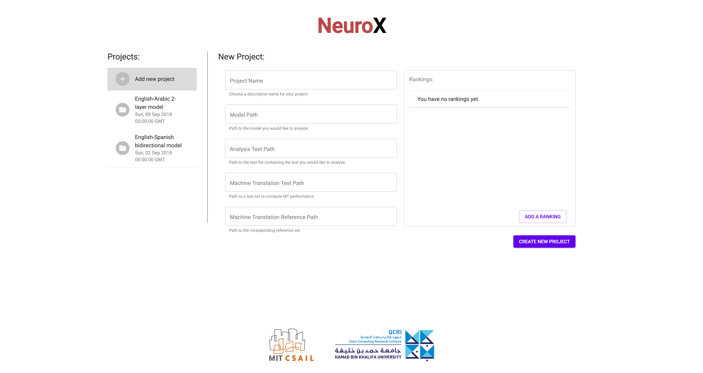
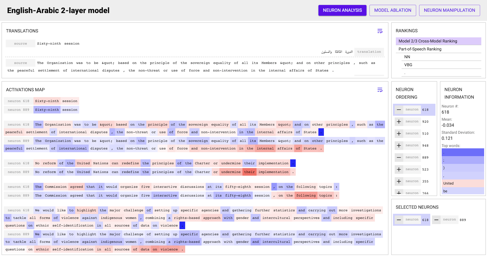
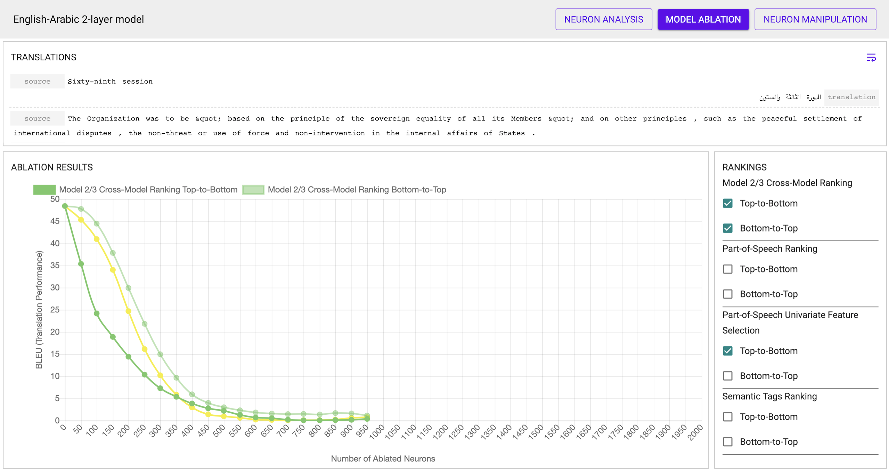
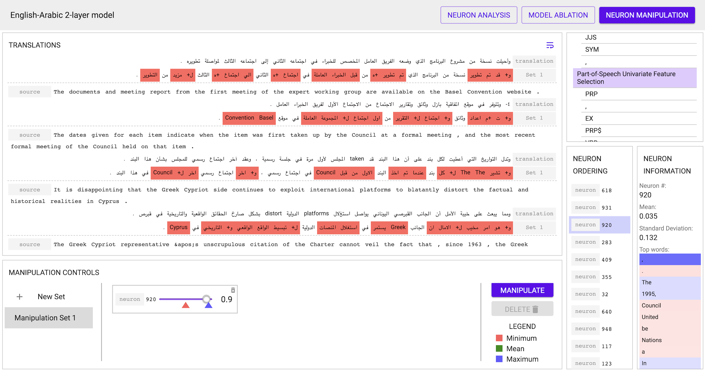

# NeuroX

### Toolkit for finding and analyzing _important_ neurons in neural networks
NeuroX is a comprehensive toolkit based on explainable AI research published in
AAAI'19 [[1]](http://www.aaai.org/Papers/AAAI/2019/AAAI-DalviF.5894.pdf) and 
ICLR'19 [[2]](https://openreview.net/pdf?id=H1z-PsR5KX). It
facilitates the analysis of individual neurons in deep neural networks.
Currently support is provided for sequence-to-sequence models trained using a
slightly modified version of the OpenNMT-py toolkit 
[[3]](https://github.com/fdalvi/opennmt-inspection). Support for other toolkits
and architectures like Transformers is planned for the near future.


The toolkit allows the user to upload a model and rank neurons based on their
saliency to the overall model, or to some specific property that is being
learned intrinsically learned inside a deep neural network (e.g. Part of Speech
tagging inside a machine translation model, position detector inside a language
model etc.)

### Instructions to run
The toolkit is written using Python 3 and is accessible through a browser as a
web application. Extensive testing has been doing using Google Chrome, but the
toolkit should be functional in other browsers as well. The toolkit is meant to
be used as Jupyter Notebooks are used - a server is launched (either on your
local machine or on a more powerful server), and the application is then
accessible using a URL.

#### Running the server:
1. Getting the code:
```bash
git clone https://github.com/fdalvi/NeuroX.git
cd neuroX/
git submodule init
git submodule update
```

2. Setting up the environment:
```bash
conda env create -f conda-environment.yml -n neurox-env
source activate neurox-env
```

3. Running the server:
```bash
python app.py
```

The server will be up and running on the localhost at port `5001`. You can set
any environment variables such as `CUDA_VISBLE_DEVICES` or `CUDA_CACHE_PATH` and
they will be used for the computation that will be done later.

4. Accessing the toolkit: Visit `http://localhost:5001` or 
`http://<server-ip>:5001`

5. (a) Starting a new project:

Fill in the required details to start a new project. You will need to provide
the path to a OpenNMT-py model _trained using 
[[3]](https://github.com/fdalvi/opennmt-inspection)_. You will also need to 
provide the path to a text file which will serve as the input to your model for
analysis. Finally, you will also need to provide a _ground truth_ test set 
(input and output reference) to run the ablation studies. Apart from this basic
information, you can add an arbitrary number of ranking schemes using the
rankings dialog on the right (See section 
[Rankings Overview](https://github.com/fdalvi/NeuroX/blob/master/README.md#rankings-overview)
 for an explanation of the various ranking schemes).

5. (b) Loading an existing project: Just select the project from the sidebar to
see it's details and load an existing project.

6. Waiting for Computation: Depending on the number of rankings and the size of
your models/test data, it will take a while to compute all of the information 
required to analyze the neurons. You will see a loading screen while this is 
taking place:

It is highly recommended to run the server with access to a GPU to speed up the
computation. The analysis requires running the trained OpenNMT-py model several
times to extract activations, train several classifiers to generate the
rankings, run several evaluations to compute the ablation results and also run
the model in real-time to manipulate the results. All of these tasks are
significantly faster on a GPU. All of the computation for a project is done
once and cached, and hence you can leave the page and come back to it later and 
all of the results will be available instantaneously.

7. Perform your analysis! The toolkit provides three major _views_:
	- The **Analysis view** allows you to view the various rankings, select 
	multiple neurons to see their activation maps on the input data, and look
	at statistics for individual neurons such as their top words. 
	
	- The **Ablation view** allows you to view the results of ablation using the
	various rankings. This information can be useful to (i) verify the 
	correctness of the rankings, and (ii) hypothesis what information is more or
	less important to the network
	
	- The **Manipulation view** allows you to control the activation patterns of
	individual neurons and see the effect on the target in real-time
	

### Rankings Overview
Various ranking schemes can be used to rank the individual neurons in a given 
model:
1. Cross-Model Correlation: Rank neurons by how correlated their activation 
patterns are to neurons in other networks trained to perform the same task. This
method is unsupervised and just requires two or more models trained for the same
task.
2. Linguistic Correlation: Rank neurons by how well they predict a given 
property. This method is supervised, and requires a annotated set where each
input word is tagged with a property of interest
3. Univariate Feature Selection: Similar to Linguistic Correlation, but applies
a different criteria to rank the neurons.

Please see the links below for details behind each method and how the rankings
are actually computed.

### Links
- [1] AAAI'19 Publication: [What Is One Grain of Sand in the Desert? Analyzing Individual Neurons in Deep NLP Models](http://www.aaai.org/Papers/AAAI/2019/AAAI-DalviF.5894.pdf)
- [2] ICLR'19 Publication: [Identifying And Controlling Important Neurons In Neural Machine Translation](https://openreview.net/pdf?id=H1z-PsR5KX)
- [3] Modified [OpenNMT-py toolkit](https://github.com/fdalvi/opennmt-inspection) to train the models that are to be analyzed
- [4] AAAI'19 Demonstration: [NeuroX: A Toolkit for Analyzing Individual Neurons in Neural Networks](https://arxiv.org/pdf/1812.09359.pdf)

### TODO
#### Short-term todos:
- [ ] Restructuring for better modularity
- [x] DB for backend
- [ ] Client side caching for requests
- [x] Computation queue on the backend
- [ ] Interaction with classifier/correlation/translation modules
- [x] Manipulation UI
- [ ] Real time Logs for computation
- [ ] Ranking confidence measures

#### Long-term todos:
- [ ] BPE/Char/Segmented support
- [ ] LM support
- [ ] General model support
- [ ] Support for file browser to select models/test files
